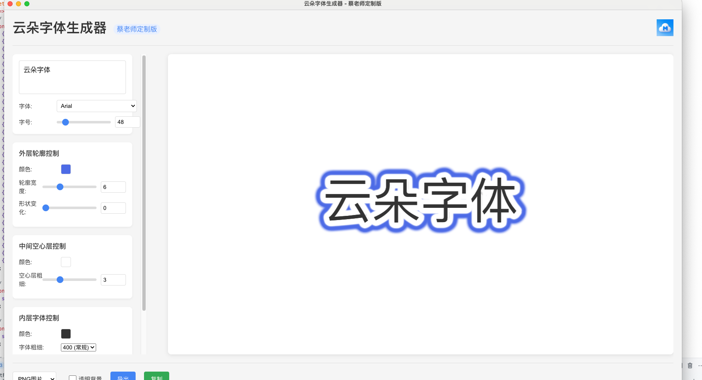

# 云朵字体生成器

一个用于生成云朵风格字体的桌面应用，支持Windows、macOS和Linux平台。



## 功能特点

- 生成云朵风格的文字效果
- 自定义外层轮廓、中间空心层和内层字体
- 支持调整字体大小、颜色、粗细和下划线
- 支持导出为PNG、SVG、CSS和JSON格式
- 支持透明背景导出

## 开发环境设置

1. 确保已安装Node.js (推荐v16或更高版本)
2. 克隆仓库并安装依赖：

```bash
git clone <仓库地址>
cd yunduo
npm install
```

3. 启动开发服务器：

```bash
npm run webpack-build
npm start
```

## 打包应用

本项目提供了跨平台打包脚本，可以轻松构建适用于Windows、macOS和Linux的可执行文件。

### 使用打包脚本

#### 在Windows上：

```bash
# 构建所有平台版本
build.bat

# 仅构建Windows版本
build.bat --win

# 仅构建64位Windows版本
build.bat --win --x64
```

#### 在macOS/Linux上：

```bash
# 构建所有平台版本
./build.sh

# 仅构建macOS版本
./build.sh --mac

# 仅构建ARM64架构的macOS版本
./build.sh --mac --arm64
```

### 打包选项

打包脚本支持以下选项：

- 平台选项：
  - `--mac` 或 `-m`: 构建macOS版本
  - `--win` 或 `-w`: 构建Windows版本
  - `--linux` 或 `-l`: 构建Linux版本
  - `--all` 或 `-a`: 构建所有平台版本（默认）

- 其他选项：
  - `--clean`: 清理之前的构建
  - `--x64`: 仅构建64位版本
  - `--ia32`: 仅构建32位版本（仅Windows）
  - `--arm64`: 仅构建ARM64版本（macOS/Linux）

### 打包输出

打包后的文件将保存在`dist`目录中，包括：

- Windows: `.exe`安装程序和便携版
- macOS: `.dmg`安装镜像和`.app`应用程序
- Linux: `.AppImage`、`.deb`和`.rpm`包

## 跨平台注意事项

### Windows

- 支持Windows 10及以上版本
- 提供安装程序和便携版

### macOS

- 支持macOS 10.13及以上版本
- 支持Intel和Apple Silicon芯片
- 提供签名和公证（需要开发者证书）

### Linux

- 提供AppImage格式，适用于大多数Linux发行版
- 提供deb包（适用于Ubuntu、Debian等）
- 提供rpm包（适用于Fedora、CentOS等）

## 许可证

MIT 